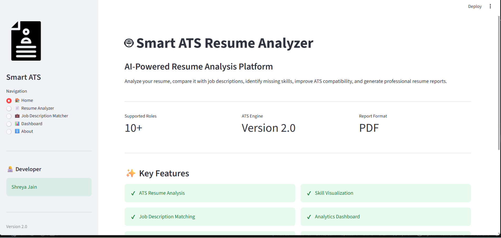
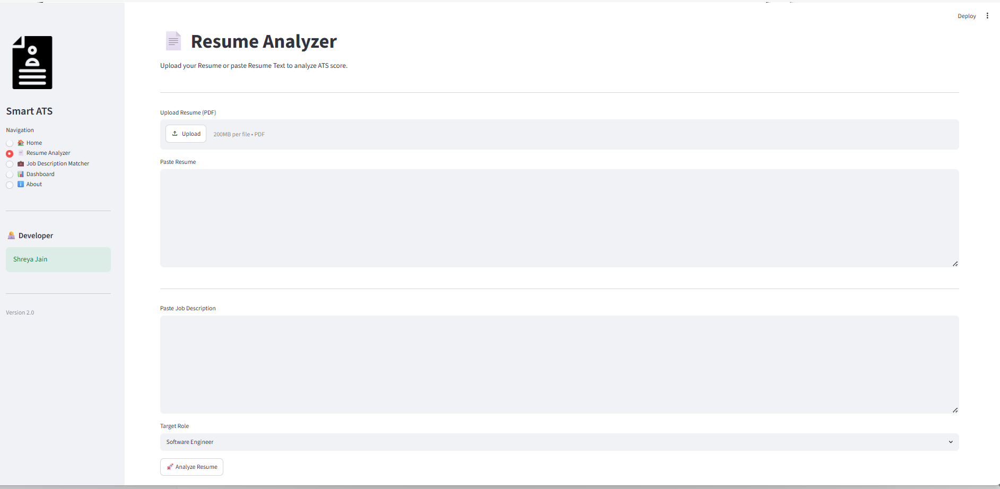
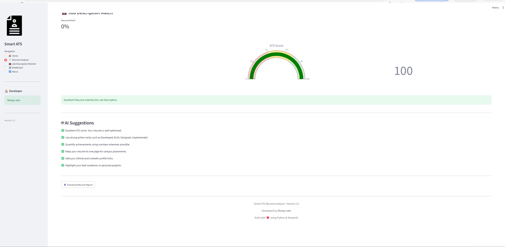

# 🤖 Smart ATS Resume Analyzer

An AI-powered Resume Analysis platform built using **Python** and **Streamlit** that helps job seekers evaluate their resumes for Applicant Tracking Systems (ATS), compare resumes with Job Descriptions, identify missing keywords, and generate improvement suggestions.

---

## ✨ Features

- 📄 Resume Upload (PDF)
- 🎯 ATS Score Calculation
- 💼 Job Description Matching
- 🤖 AI-based Resume Suggestions
- 📊 Skill Visualization
- 📈 Interactive Dashboard
- 📥 PDF Report Generation

---
## 📸 Application Screenshots

### 🏠 Home Page

---

### 📄 Resume Analyzer

---

### 📊 Analysis Dashboard

---
